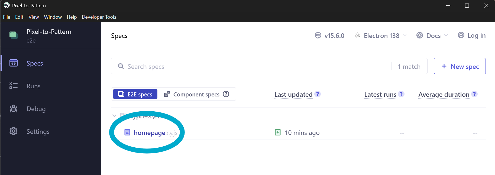

# Pixel to Pattern - Create Your Perfect Piece

**Pixel to Pattern** turns your pixel art into beautiful, beginner-friendly crochet patterns, stitch by stitch and row by row.  
Let the creativity flow.

---

## Table of Contents

- [Features](#features)
- [Tech Stack](#tech-stack)
- [Environment Variables](#environment-variables)
- [Running Locally with Docker Compose](#running-locally-with-docker-compose)
- [Local Setup (Non-Docker)](#local-setup-non-docker)
- [VM Setup & Automated Deployment](#vm-setup--automated-deployment)
- [Troubleshooting](#troubleshooting)
- [Manual Testing](#manual-testing)
- [Automated Testing Pipeline (GitHub Actions)](#automated-testing-pipeline-github-actions)

---

## Features

### Create  
Turn any pixel drawing into a crochet-ready pattern.  
Each row lists the stitch counts per color, for example:

```
(sc = single crochet)
Row 1: 28 sc (white)
Row 2: 9 sc (white), 10 sc (yellow), 9 sc (white)
Row 3: 8 sc (white), 10 sc (yellow), 9 sc (white)
```

### Read  
Browse all submitted creations and view detailed, stitch-by-stitch patterns.

### Update  
Users will soon be able to edit their own patterns directly.

### Delete
Users are able to delete their own patterns directly.

### Export to PDF 
Users are able to export their pattern to a PDF document.

---

## Tech Stack

- **Frontend:** Next.js, Material UI, React  
- **Backend:** Node.js, Express  
- **Database:** MySQL with Sequelize ORM  
- **Infrastructure:** Docker & Docker Compose  
- **CI/CD:** GitHub Actions  
- **Version:** Node 24+

---

## Environment Variables

The backend uses a `.env` file in the root directory.

### Server `.env` (example.env provided)

```
DB_USER=
DB_PASSWORD=
DB_HOST=
DB_DATABASE=
DB_PORT=
SERVER_PORT=3000
```

**Note:**  
The frontend does *not* use a `.env.production` file anymore.  
The API URL is injected during the Docker build step automatically.

---

## Running Locally with Docker Compose

Run the entire app locally in one command.

1. Clone the repository:
   ```bash
   git clone https://github.com/AlexanderORuban/Pixel-to-Pattern.git
   ```
2. Create a `.env` file in the project root (see above).
3. Start everything:
   ```bash
   docker compose up --build
   ```
4. Visit the app:  
   http://localhost:3001

### Rebuild images:
```bash
docker compose build --no-cache
docker compose up -d
```

### Restart only:
```bash
docker compose restart
```

---

## Local Setup (Non-Docker)

Only if you want to run the backend/frontend manually.

1. Clone the repo  
2. Create your `.env`  
3. Install dependencies:
   ```bash
   npm install
   ```
4. Start full dev environment:
   ```bash
   npm run dev
   ```
5. Visit http://localhost:3001

---

## VM Setup & Automated Deployment

This project includes **automatic production deployment** using GitHub Actions.  
When a pull request is merged into `main`, the app **auto-deploys** to the VM.

### 1. First-Time VM Setup (only done once)

SSH into the VM:
```bash
ssh root@<VM_IP>
```

Install Docker + Compose:
```bash
sudo apt-get update -y
yes | sudo DEBIAN_FRONTEND=noninteractive apt-get -yqq upgrade
sudo apt install -y ca-certificates curl gnupg lsb-release
sudo mkdir -p /etc/apt/keyrings
curl -fsSL https://download.docker.com/linux/ubuntu/gpg \
 | sudo gpg --dearmor -o /etc/apt/keyrings/docker.gpg
echo "deb [arch=$(dpkg --print-architecture) \
 signed-by=/etc/apt/keyrings/docker.gpg] \
 https://download.docker.com/linux/ubuntu $(lsb_release -cs) stable" \
 | sudo tee /etc/apt/sources.list.d/docker.list > /dev/null
sudo apt update
sudo apt install -y docker-ce docker-ce-cli containerd.io \
 docker-buildx-plugin docker-compose-plugin
```

Confirm install:
```bash
docker run hello-world
```

After this, the VM is fully ready for auto-deployment.

---

### 2. Automated Deployment (GitHub Actions)

Every time you merge a PR into `main`:

✔ Latest code is pulled onto the VM  
✔ Old deployment folder is removed  
✔ `.env` is written using GitHub Secrets  
✔ Containers are rebuilt + restarted  
✔ Backend is checked with `/health` endpoint  
✔ Deployment succeeds or fails in GitHub Actions

### Required GitHub Secrets

| Secret | Purpose |
|--------|---------|
| `VM_HOST` | VM IP |
| `VM_USERNAME` | Usually `root` |
| `VM_PASSWORD` | VM password |
| `DB_HOST` | MySQL host |
| `DB_USER` | DB user |
| `DB_PASSWORD` | DB password |
| `DB_DATABASE` | DB name |
| `DB_PORT` | DB port |
| `NEXT_PUBLIC_API_URL` | Backend URL (e.g., http://<VM_IP>:3000) |

### Workflow location
```
.github/workflows/deploy.yml
```

You never need to SSH and deploy manually unless something breaks.

---

## Troubleshooting

**Ports already in use**
```bash
docker ps
docker stop <container>
```

**MySQL issues**
- Ensure `.env` exists on VM
- Use `DB_HOST=db` when running under Docker  
Check DB logs:
```bash
docker logs db
```

**Frontend hitting 404s**
- Means wrong API URL was injected  
- Update `NEXT_PUBLIC_API_URL` secret  
- Merge another PR to redeploy

---

## Manual Testing
### Run all unit and integration tests in Docker
1. *(If needed)* force Docker to build/rebuild clean docker-compose.test image: 
```
docker compose -f docker-compose.test.yml build --no-cache
```
2. Spin up Docker test services:
```
docker compose -f docker-compose.test.yml up
```
3. Close Docker test services:
```
docker compose -f docker-compose.test.yml down -v
```
### Run backend unit tests
#### Locally
From the server directory, run `npm run test:unit` to run Jest unit tests locally.
#### In Docker
1. From the root, run `docker compose -f docker-compose.test.yml up backend-unit-tests --abort-on-container-exit --exit-code-from backend-unit-tests`
2. Clean up: `docker compose -f docker-compose.test.yml down -v`
### Run frontend unit tests
#### Locally
From the client directory, run `npm test` to run Jest unit tests locally.
#### In Docker
1. From the root, run `docker compose -f docker-compose.test.yml up frontend-tests --abort-on-container-exit --exit-code-from frontend-tests`
2. Clean up: `docker compose -f docker-compose.test.yml down -v`
### Run backend integration tests
Only run the integration tests in the docker compose test.
1. From the root, run `docker compose -f docker-compose.test.yml up db-test backend-integration  --abort-on-container-exit --exit-code-from backend-integration`
2. Clean up: `docker compose -f docker-compose.test.yml down -v`
### Run E2E tests
- Run from the *root* of the project
- The app needs to be running in docker locally *before* testing
- Remember to run `npm i` first
#### Option 1 | Through Bash Terminal
```bash
npm run cypress:run
```

#### Option 2 | Through Cypress GUI (useful for dev)
```bash
npm run cypress:open
```
1. Click the "E2E Testing" card
1. Select a browser to view the app in
1. Select a spec to run from the list, it will auto-run the tests anytime there are changes made to the spec


---

## Automated Testing Pipeline (GitHub Actions)

Located in:
```
.github/workflows/test.yml
```

Runs automatically on:
- Pushes to `main` or `development`
- PRs targeting `main` or `development`

Runs:
- Backend unit tests  
- Backend integration tests  
- Frontend unit tests  
- Cypress E2E tests  

Blocks merges if any suite fails.  
View results in the GitHub “Actions” tab.

---